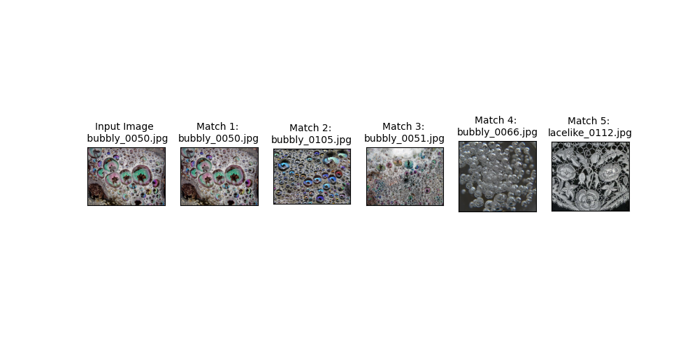
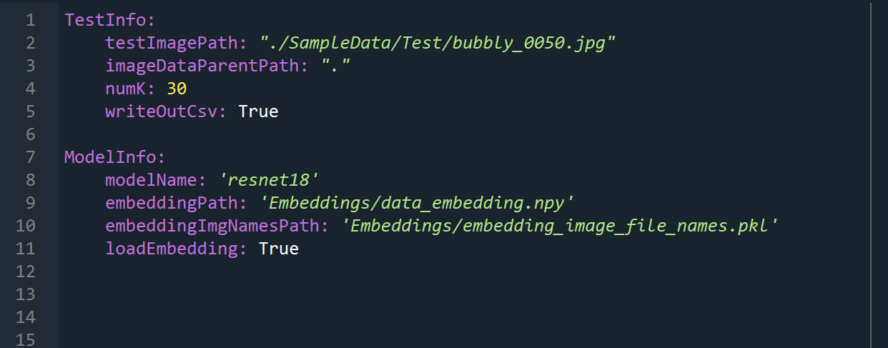
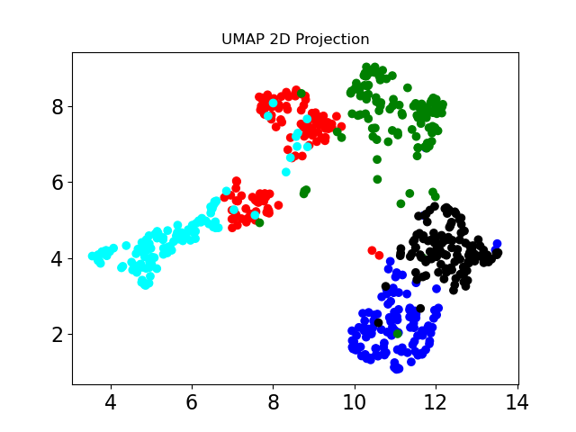
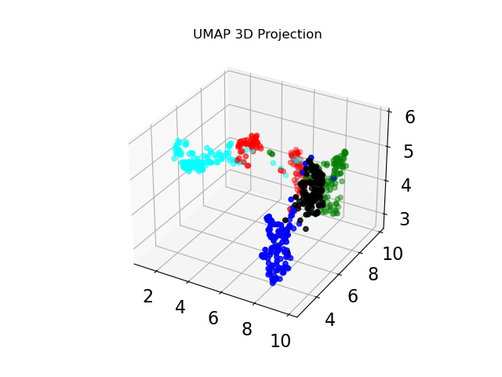

# Computing Image Similarity Using Features Extracted From A Pre-trained Model
## **Executive Summary**
The following repository allows a user to input an image and the program will return the top K
images that are most similar to the single input image. The program will print out the top K image
matches to the command prompt once the test_main.py script is executed. Additionally, a csv file
containing information on all top K matches including match rank and file name. A
figure showing the top 5 (or less if K<5) matches will be written into the "Results" folder of the parent
directory from which the software is run. All of the code is written in Python.

## **Algorithm Summary**
The algorithmic approach is to use a feature extraction algorithm to extract features for all of the available
images in the dataset, use the same algorithm to extract features for the image of interest, and then
compute the distance between the features of the image of interest and the full data set in order to identify
the K most similar images. The quality of the feature extraction model is evaluated by projecting the
features into a low dimensional space and analyzing the separation of the different class samples.

For the current work, feature extraction is performed within the Pytorch framework using a pretrained
ResNet architecture. Features are projected into a reduced dimensional space (both 2 and 3
dimensions) for inspection using the Uniform Manifold Approximation and Projection (UMAP) Python
framework to confirm the ability of the architecture to extract sufficiently discriminative features for the
given sample set. A k-nearest neighbor algorithm is used to compute the cosine distance of the computed
input image features with the features of all the available images. The computed cosine distances are then
used to rank and return the K most similar images

## **QuickStart Guide**
1) Navigate to the main parent directory. Set this as the current working directory.
2) Navigate to the configuration file “testMainConfiguration.yaml” within the “ConfigurationFiles”
folder. Here the user can set the path to the desired input image (“testImagePath” field) along with
K (“numK” field), i.e. the number of most similar images to return. If K is 5 or greater, only the
top 5 matches will be shown in the figure, but all K matches will be written out to the csv file and
the console.
3) Navigate back to the main parent directory and run “test_main.py”. The top K matches will be
printed out to the console. A .csv file and .png figure will also be saved in the "Results" folder.

## **File Descriptions**
**test_main.py** : main execution script. This script runs the program based on the settings provided in the
“testMainConfiguration.yaml” file in the “ConfigurationFiles” folder. Example outputs shown below:

**Figure** 1 : Top : Screenshot of the figures that get saved during execution of test_main.py
showing the input image and the top 5 matches. Bottom: Screenshot of the csv file written out to the
“Results” folder during execution of test_main.py.

**pretrained_model_feature_extractor.py** : this file contains the classes and methods associated with
instantiating and evaluating the ResNet model within the Pytorch framework. It also contains the
methods for computing and saving off the embedding of all the files and executing evaluation of the test
image.

**testMainConfiguration.yaml** : (located in “ConfigurationFiles” folder) configuration file associated with
running the test_main.py. Users should modify the fields in the “TestInfo” section to run as desired. The
“testImagePath” should be set to the image to be compared, the “imageDataParentPath” is the location of
the data directory that contains all of the data, and
“numK” is the number of K most similar images that will be returned by the test script. An example
screenshot of the configuration file is shown below.

**Figure 2** : Screenshot of configuration file used to run test_script.py.

**img_similarity_utils.py** : this file contains a number of helper functions including those that compute the
K nearest neighbors given the embedding and input feature set, create and write out the figure and csv
files, and compute the UMAP representations.

## **Algorithm SubSystem Steps**
**Feature Extraction:** 
Feature extraction is performed using a pretrained ResNet architecture provided by the
torchvision.models subpackage within Pytorch. The provided test images are zero-padded to meet the
input size required by the model, scaled to a range of 0 to 1, and normalized using the mean and standard
deviation of the ImageNet data set. The architecture returns a one-dimensional feature vector of length
2048 for a single image (returned vector length depends on the model selected from Resnet-50, Resnet-18, or Resnet-101). The model is used to process all the available images in the provided dataset and
this matrix of features is saved off as a binary numpy file to be read in at the time of execution.

**Visualization of Feature Space:**
Visualization of the feature space is performed using the Uniform Manifold Approximation and
Projection (UMAP) dimensional reduction technique. Feature vectors are computed for the entire
texture data set to generate a nImages by 2048 feature vector matrix, and the UMAP
technique is used to project the matrix into both 2 and 3-dimensional space as a means to analyze the
separability of the different texture types, i.e, if the features output by the final ResNet layer
are sufficiently discriminative for the current images, it is anticipated that this will be reflected in the
reduced projected space through spatial separation of the different texture sample classes.

Figure 3 presents the projection of the features extracted for the current dataset for both two and three
dimensional space. It is observed that the features are reasonably well separated based on their texture
class. Spatial overlap appears between the banded and striped (red and cyan), though these similarities are
confirmed through visual inspection of the image set and as such are to be expected.

**Figure 3** : Top : UMAP 2-D projection. Bottom : UMAP 3-D projection. The color scheme is as follows :
red: banded; black: lacelike; cyan: striped; green: grid; blue: bubbly.

**Calculation of the K Most Similar Images:**
Calculation of the K most similar images is performed using the k-nearest neighbors algorithm available
as part of the sklearn Python package. Once the features have been computed for the image of interest the
“NearestNeighbors” algorithm computes the cosine distance between the features of the image of interest
and the previously computed nImages by 2048 matrix of features of the entire dataset. The images are
ranked based on these distances and returned in the order of smallest distances. Note that the algorithm
returns the test image as the top match if it is available in the data set.

